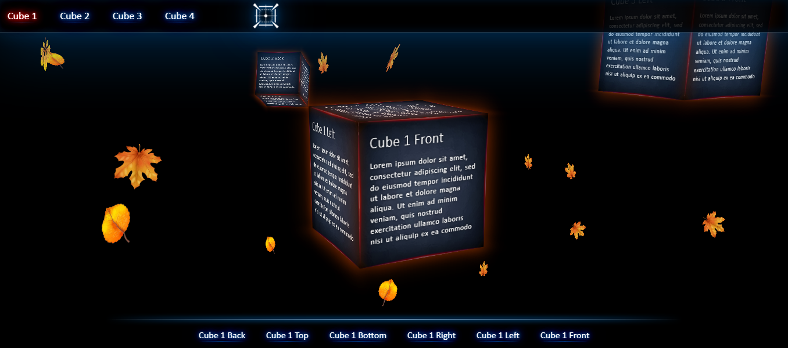

# Полноценный трехмерный сайт с возможностью перемещения в пространстве.

# A full-fledged three-dimensional website with the ability to move in space.

## Данный проект дает базовое понимание, как делать 3D объекты с помощью HTML, CSS и JS без использования библиотек и сanvas. Возможна рациональная идея - граненый цилиндр. Или например, текстурированный коридор, на стенах которого висят плоскости стилизованные под картины, а картины представляют собой страницы сайта. В общем, идеи ограничиваются нашей фантазией. 

## This project provides a basic understanding of how to make 3D objects using HTML, CSS and JS without using libraries and with canvas. A rational idea is possible - a faceted cylinder. Or, for example, a textured corridor, on the walls of which there are planes stylized as paintings, and the paintings represent the pages of the site. In general, ideas are limited to our imagination.

## HTML, CSS, JS

